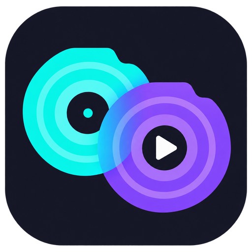
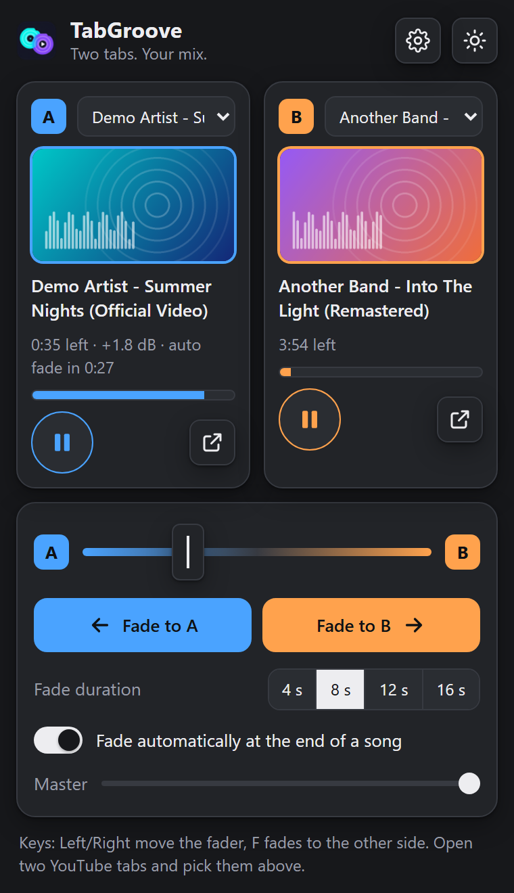
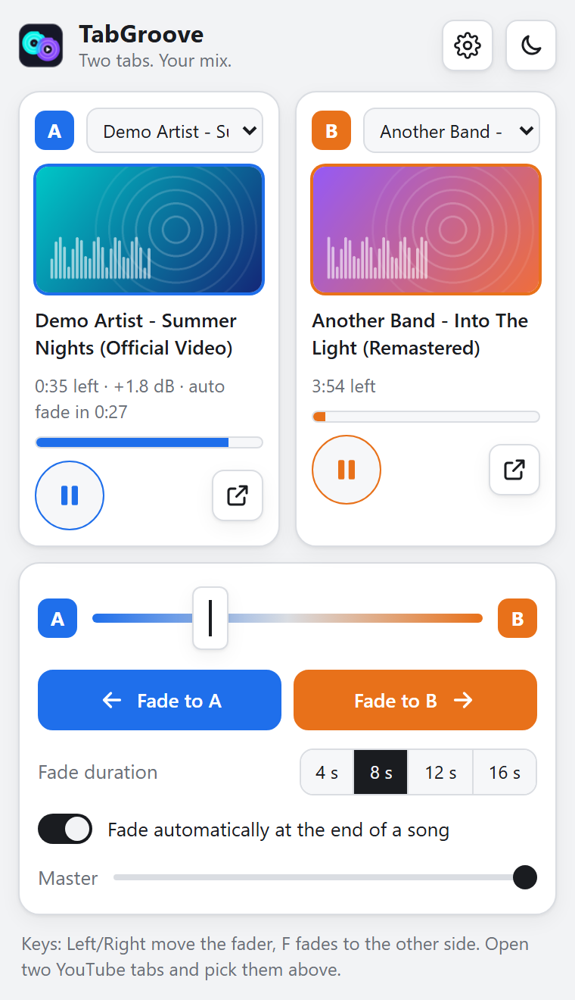
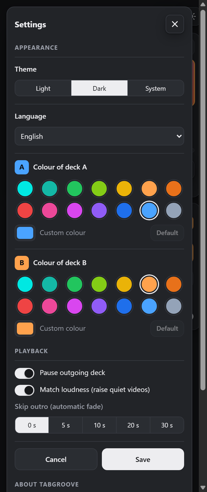
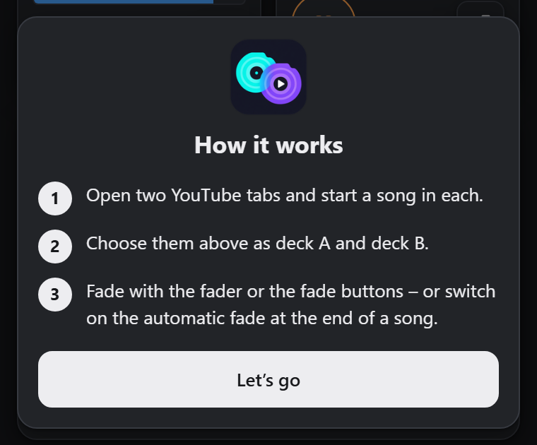

# TabGroove

### Zwei Tabs. Dein Mix.

**Eine kostenlose Chrome-Erweiterung, die zwischen zwei YouTube-Tabs überblendet wie ein DJ – von Hand oder automatisch am Liedende.**

[English](README.md) · [Warum TabGroove?](#warum-tabgroove) · [Installation](#installation) · [Nutzung](#nutzung) · [Fehler melden](#fehler-gefunden)

---

> ❤️ **TabGroove ist kostenlos – und bleibt es auch.** Keine Werbung, kein Tracking, kein Abo, kein Konto. Wenn dir die Erweiterung gefällt, erzähl es weiter.

## Was ist TabGroove?

Du hörst Musik am liebsten auf YouTube – die Versionen, Live-Aufnahmen und Remixe, die es sonst nirgends gibt – und hast vielleicht YouTube Premium. Aber jeder Liedwechsel bedeutet einen harten Schnitt, Stille oder Jonglieren mit zwei Tabs und ihren Lautstärkereglern.

**TabGroove macht aus zwei ganz normalen YouTube-Tabs Deck A und Deck B eines kleinen DJ-Mixers.** Ein Seitenpanel neben YouTube bietet Crossfader und Blende-Knöpfe. Ein Lied läuft weiter, während du im anderen Tab das nächste suchst – und wenn du so weit bist, geht die Musik weich von einem Lied ins nächste über.

&nbsp;&nbsp;

## Warum TabGroove?

Was sich gegenüber zwei YouTube-Tabs von Hand ändert:

| | Zwei Tabs von Hand | Mit TabGroove |
|---|---|---|
| **Liedwechsel** | Einen pausieren, den anderen starten – harter Schnitt oder Stille | Weiche Überblendung mit Equal-Power-Kurve |
| **Zeitpunkt** | Im richtigen Moment an zwei Stellen klicken | Ein Klick oder ganz automatisch am Liedende |
| **Nächstes Lied vorbereiten** | Es spielt los, sobald du es anklickst | Es wartet bei 0:00 im stummen Deck, bis du es einblendest |
| **Outros** | Lange Abspänne laufen bis zum Ende | Werden bei der Auto-Blende auf Wunsch übersprungen |
| **Lautstärke** | Leise Uploads bleiben leiser als andere | Leise Videos werden auf YouTubes Lautheits-Zielwert angehoben |
| **Überblick** | Zwischen Tabs springen, um zu sehen, was läuft | Beide Decks mit Titel, Restzeit und Fortschritt in einem Panel |
| **Dein YouTube** | ✔ | ✔ Gleiche Tabs, gleiche Suche, gleiches Login – YouTube Premium funktioniert weiter |

## Funktionen

- **Zwei Decks, echtes YouTube.** Jedes Deck ist ein normaler YouTube-Tab mit eigener Suche, Playlists und deinem Login.
- **Crossfader und Blende-Knöpfe.** Von Hand blenden oder *Zu A blenden* / *Zu B blenden* drücken (4, 8, 12 oder 16 Sekunden). Das einblendende Deck startet von selbst, das ausgeblendete wird am Ende pausiert.
- **Automatisch am Liedende überblenden.** Einschalten, und TabGroove blendet kurz vor Schluss in das Lied, das auf dem anderen Deck wartet. Ein Countdown zeigt, wann es so weit ist.
- **Outro überspringen.** Die Auto-Blende 5–30 Sekunden früher starten, für Videos mit langem Abspann.
- **Nächstes Lied startklar.** Ein Video, das du im stummen Deck öffnest, wird am Anfang angehalten und ist bereit zum Einblenden.
- **Lautstärke angleichen.** YouTube senkt zu laute Videos ab, lässt leise aber, wie sie sind. TabGroove hebt leise Videos auf dasselbe Niveau an (bis +6 dB, mit Begrenzer gegen Übersteuern).
- **Dein Look.** Helles, dunkles oder System-Design und eigene Farben für Deck A und B.
- **Fünf Sprachen.** Englisch (Standard), Deutsch, Französisch, Spanisch und Italienisch.
- **Tastatur.** `←` / `→` bewegen den Fader, `F` blendet zur anderen Seite.
- **Kurzanleitung und „Was ist neu“** direkt in der Erweiterung.

Kein EQ, keine Effekte, kein Beatmatching – TabGroove macht eine Sache: die Blende.

## Installation

TabGroove ist noch nicht im Chrome Web Store. Du installierst es als „entpackte Erweiterung“ – das dauert etwa eine Minute.

**Voraussetzungen:** Google Chrome 116 oder neuer unter Windows, macOS oder Linux. Andere Chromium-Browser funktionieren eventuell, sind aber nicht getestet.

1. **Herunterladen:** die neueste `TabGroove-x.y.z.zip` von der Seite [Releases](https://github.com/rofldark/tabgroove/releases) 
   (oder auf dieser Seite **Code → Download ZIP** klicken oder das Repository klonen).
2. **Entpacken** in einen Ordner, der dauerhaft bleibt, zum Beispiel `Dokumente\TabGroove`. 
   Chrome lädt die Erweiterung aus diesem Ordner – ihn später nicht löschen oder verschieben.
3. In der Adressleiste **`chrome://extensions`** öffnen.
4. Oben rechts den **Entwicklermodus** einschalten.
5. **Entpackte Erweiterung laden** klicken und den Ordner wählen, in dem `manifest.json` liegt 
   (den entpackten Release-Ordner oder den Ordner `extension`, wenn du das ganze Repository geladen hast).
6. **TabGroove anpinnen:** in der Symbolleiste auf das Puzzle-Symbol klicken und TabGroove anheften, damit das Icon immer sichtbar ist.
7. Auf das **TabGroove-Icon** klicken – das Seitenpanel öffnet sich mit einer kurzen Anleitung.

### Aktualisieren

1. Die neue Version herunterladen und die Dateien in deinem TabGroove-Ordner ersetzen.
2. Auf `chrome://extensions` bei TabGroove auf den **Neuladen-Pfeil** klicken.
3. Offene YouTube-Tabs einmal neu laden (das Panel erinnert dich bei Bedarf daran).

Deine Einstellungen bleiben erhalten.

### Deinstallieren

Auf `chrome://extensions` bei TabGroove auf **Entfernen** klicken. Danach kannst du den Ordner löschen.

## Nutzung

1. **Zwei YouTube-Tabs** öffnen und in jedem ein Lied starten.
2. Auf das **TabGroove-Icon** klicken. Im Seitenpanel die Tabs für **Deck A** und **Deck B** wählen – bei zwei offenen YouTube-Tabs passiert das automatisch.
3. Deck A hören. Im anderen Tab **das nächste Lied suchen** und anklicken – es wartet am Anfang.
4. Wenn du so weit bist, **Zu B blenden** drücken (oder `F`). Oder **Automatisch am Liedende überblenden** einschalten und zurücklehnen.
5. Auf dem jetzt stummen Deck das nächste Lied vorbereiten – und so weiter.

Tipp: Der Pfeil-Knopf an jedem Deck springt direkt zu dessen Tab, dort kannst du suchen.

### Einstellungen

Auf das Zahnrad klicken. Änderungen siehst du sofort als Vorschau, **Speichern** übernimmt sie.

| Bereich | Optionen |
|---|---|
| **Darstellung** | Design (hell, dunkel, System), Sprache, Farben von Deck A und B |
| **Wiedergabe** | Ausgeblendetes Deck nach der Blende pausieren, Lautstärke angleichen, Outro überspringen bei der Auto-Blende |
| **Über TabGroove** | Was ist neu, Kurzanleitung, Links, alle Einstellungen zurücksetzen, Version |

&nbsp;&nbsp;

## Funktionsweise

- Wenn du einen Tab als Deck wählst, setzt TabGroove eine kleine Steuerung in diese YouTube-Seite. Sie leitet das Video der Seite durch einen Web-Audio-Gain-Knoten – der Crossfader ändert nur diesen Gain.
- Blenden laufen auf der Audio-Uhr im Tab und bleiben dadurch gleichmäßig, auch wenn Panel oder Tab gerade beschäftigt sind.
- Für das Angleichen der Lautstärke liest TabGroove dieselben Lautheitswerte, die YouTube unter *Statistiken für Interessierte* anzeigt.
- Alles passiert lokal in deinem Browser.

## Datenschutz und Berechtigungen

TabGroove hat **keine Server, keine Analyse und kein Tracking**. Es erhebt und sendet keine Daten über dich oder das, was du hörst. Einstellungen speichert Chrome lokal. Die einzigen Netzwerkanfragen des Seitenpanels sind die Vorschaubilder der Videos, geladen von YouTubes Bildserver – dieselben Bilder, die YouTube dir sowieso zeigt. Details: [Datenschutzerklärung](PRIVACY.md#datenschutzerklärung--tabgroove).

| Berechtigung | Wofür sie nötig ist |
|---|---|
| `tabs` | Um deine YouTube-Tabs mit Titel und Adresse aufzulisten, damit du sie als Decks wählen kannst |
| `scripting` | Um die kleine Audio-Steuerung in die beiden gewählten YouTube-Tabs zu setzen |
| `sidePanel` | Um den Mixer neben YouTube anzuzeigen |
| `storage` | Um deine Einstellungen zu speichern |
| `youtube.com`, `music.youtube.com` | TabGroove arbeitet nur auf diesen Seiten |

## Einschränkungen

- **Nur Chrome** am Computer. Nicht fürs Handy.
- Für die Auto-Blende muss das Seitenpanel offen bleiben.
- Beim Schließen des Seitenpanels bleiben die Lautstärken in den Tabs, wie sie sind – ein ausgeblendetes Deck bleibt stumm. Zum Zurücksetzen den Tab neu laden.
- Zeigt ein Deck *„Vom Browser stumm – einmal in diesen Tab klicken“*, blockiert Chrome den Ton dieses Tabs, bis du einmal hineinklickst.
- Nach einem Update von TabGroove müssen offene YouTube-Tabs einmal neu geladen werden.
- Das Angleichen der Lautstärke nutzt interne Daten von YouTube. Ändert YouTube diese, bleiben leise Videos einfach unverändert.
- Die Auto-Blende kennt nur die Länge des Videos, nicht das tatsächliche Ende der Musik – für lange Abspänne *Outro überspringen* nutzen.
- YouTube-Music-Tabs lassen sich auch wählen, sind aber weniger getestet.
- Änderungen an der YouTube-Webseite können Funktionen stören. Bitte melde es, wenn das passiert.

## Fehler gefunden?

**Bitte melde ihn – jede Meldung hilft!** Eröffne ein [Issue](https://github.com/rofldark/tabgroove/issues) und gib nach Möglichkeit an:

- die **TabGroove-Version** (Einstellungen → ganz unten) und deine **Chrome-Version** (`chrome://version`),
- **was du gemacht hast, was du erwartet hast und was passiert ist**,
- einen **Screenshot** vom Seitenpanel – bei Lautstärke-Problemen auch von YouTubes *Statistiken für Interessierte* (Rechtsklick aufs Video),
- die beiden **YouTube-Links**, falls es nur bei bestimmten Videos auftritt.

Ideen und Vorschläge sind ebenfalls willkommen.

## Häufige Fragen

**Funktioniert YouTube Premium?**
Ja. Die Decks sind deine normalen YouTube-Tabs mit deinem Login, Premium funktioniert also wie gewohnt.

**Blockiert TabGroove Werbung?**
Nein. Ohne Premium zeigt YouTube seine Werbung wie üblich.

**Ist das DJ-Software?**
Kein Beatmatching, kein EQ, keine Effekte. TabGroove ist zum Hören gemacht: weiche Übergänge zwischen den Liedern, die du auswählst.

**Ist es wirklich kostenlos?**
Ja, und das bleibt auch so.

## Rechtliches

TabGroove ist ein kostenloses Hobbyprojekt und steht in keiner Verbindung zu YouTube oder Google, wird von ihnen weder unterstützt noch gesponsert. YouTube ist eine Marke der Google LLC. TabGroove lädt keine Inhalte herunter und speichert keine – es ändert nur die Lautstärke der YouTube-Tabs, die du auswählst. Gedacht für privates Hören; öffentliches Mixen urheberrechtlich geschützter Musik kann gegen die YouTube-Nutzungsbedingungen verstoßen.

## Lizenz

[MIT](LICENSE) © 2026 rofldark
